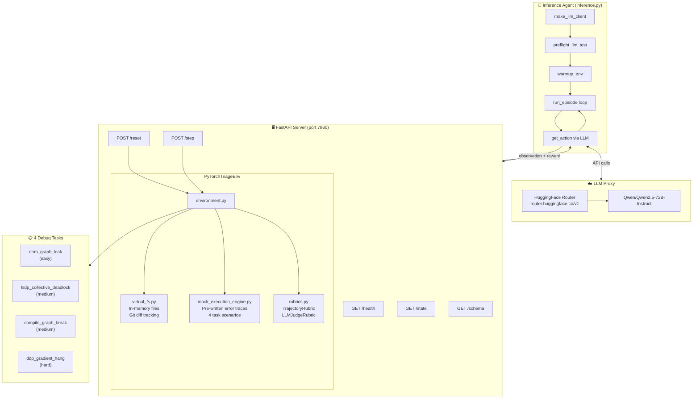
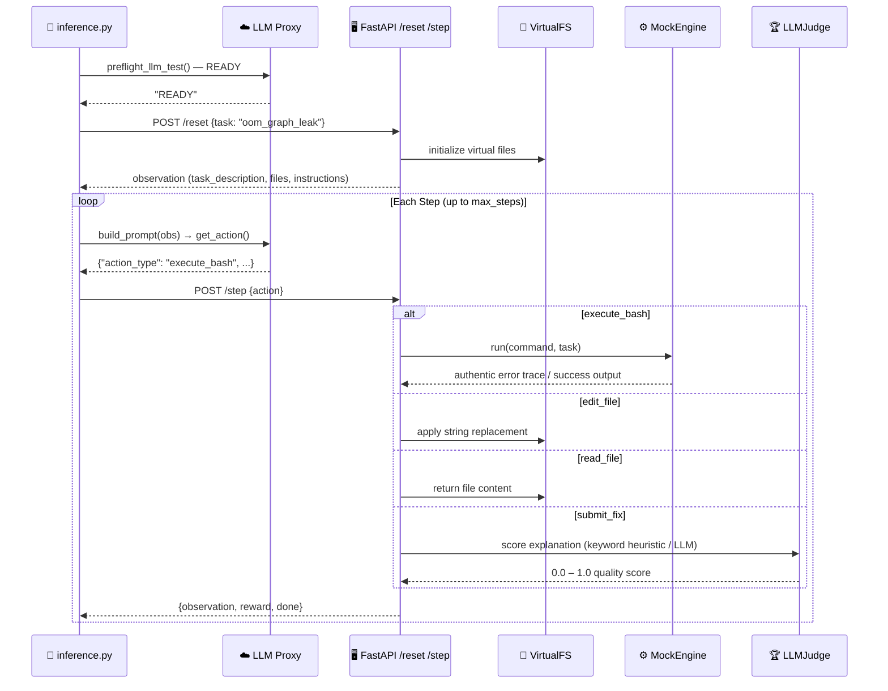

# pytorch_triage_env 🔥

> **OpenEnv Hackathon 2026** — A PyTorch Training Infrastructure Triage RL Environment

[](https://huggingface.co/spaces/an8136/pytorch-triage-env)
[](https://huggingface.co/spaces/an8136/pytorch-triage-env)
[](https://python.org)
[](Dockerfile)

An LLM agent acts as a **Staff ML Infrastructure Engineer** debugging real production PyTorch training failures. It reads virtual files, edits code, runs mock training (generating authentic PyTorch error traces), and submits a verified fix with a deep technical explanation.

---

## Architecture



### Data Flow



---

## Tasks

| Task | Difficulty | Max Steps | Root Cause | Fix |
|------|-----------|-----------|------------|-----|
| `oom_graph_leak` | Easy | 8 | `epoch_loss += loss` retains computation graph across batches → CUDA OOM | Use `loss.item()` to detach |
| `fsdp_collective_deadlock` | Medium | 9 | `all_reduce` inside `if rank == 0` — only rank 0 calls it, others hang | Move collective ops outside rank conditionals |
| `compile_graph_break` | Medium | 10 | Data-dependent Python branch forces Dynamo to eager mode → recompilation overhead | Add `@torch.compiler.disable` to problematic function |
| `ddp_gradient_hang` | Hard | 9 | Conditional auxiliary head used every 5th step → unused params → DDP hangs on gradient sync | Set `find_unused_parameters=True` in DDP wrapper |

---

## Action Space

Agents interact via JSON actions sent to `POST /step`:

```json
// Read a file
{"action_type": "read_file", "filename": "train.py"}

// Edit a file (old_str must match exactly)
{"action_type": "edit_file", "filename": "train.py", "old_str": "epoch_loss += loss", "new_str": "epoch_loss += loss.item()"}

// Run a command
{"action_type": "execute_bash", "command": "python train.py"}

// View git diff
{"action_type": "view_git_diff", "filename": null}

// Submit fix with deep explanation
{"action_type": "submit_fix", "explanation": "The root cause is X because Y. The fix works because Z."}
```

**Available files:** `train.py`, `model.py`, `config.py`, `data_loader.py`

---

## Reward System

```
Dense per-step rewards:
  +0.08  reading signal files (train.py, model.py)
  +0.12  correct diagnostic flags detected
  +0.05  running training (execute_bash)
  +0.05  file edits
  -0.08  syntax errors introduced

Terminal reward (on submit_fix):
  up to 1.0 × LLMJudge score

  "I changed X to Y"                    → 0.3
  "Root cause is A because B; fix C"    → 0.7
  "Root cause + mechanism + prevention" → 1.0

Score range: strictly (0.001, 0.999) — open interval required by validator
```

---

## Project Structure

```
pytorch_triage_env/           # Installable Python package
├── __init__.py
├── openenv.yaml              # OpenEnv spec definition (RFC 004)
├── pyproject.toml
├── Dockerfile                # Port 7860
├── README.md
└── server/
    ├── __init__.py
    ├── app.py                # FastAPI server — /reset /step /state /health /schema
    ├── environment.py        # PyTorchTriageEnv — reset() step() state property
    ├── virtual_fs.py         # In-memory file system with git diff tracking
    ├── mock_execution_engine.py  # 4 task scenarios with authentic PyTorch traces
    ├── rubrics.py            # TrajectoryRubric + LLMJudgeRubric scoring
    ├── models.py             # Pydantic v2 discriminated union action models
    └── requirements.txt

inference.py                  # Baseline LLM agent (repo root — required by validator)
tests/
├── test_engine.py
├── test_rubrics.py
├── test_environment.py
└── test_server.py
```

---

## Setup & Installation

### Requirements
- Python 3.11+
- Docker (optional, for containerized deployment)

### Install

```bash
# Clone the repo
git clone https://github.com/AkankshaNarula/pytorch-triage-env.git
cd pytorch-triage-env

# Install the package
cd pytorch_triage_env && pip install -e . && cd ..
```

### Run the Server

```bash
# Start the FastAPI server
uvicorn pytorch_triage_env.server.app:app --port 7860

# Or with Docker
docker build -f pytorch_triage_env/Dockerfile -t pytorch-triage-env ./pytorch_triage_env
docker run -p 7860:7860 pytorch-triage-env
```

### Run the Agent

```bash
export HF_TOKEN=hf_your_token_here
export MODEL_NAME=Qwen/Qwen2.5-72B-Instruct
export ENV_URL=http://localhost:7860   # or https://an8136-pytorch-triage-env.hf.space

python inference.py
```

---

## Environment Variables

| Variable | Required | Default | Description |
|----------|----------|---------|-------------|
| `HF_TOKEN` | **Yes** | none | HuggingFace API token (injected by validator) |
| `API_BASE_URL` | No | `https://router.huggingface.co/v1` | LiteLLM proxy endpoint |
| `MODEL_NAME` | No | `Qwen/Qwen2.5-72B-Instruct` | Model identifier |
| `ENV_URL` | No | `https://an8136-pytorch-triage-env.hf.space` | Environment server URL |
| `LOCAL_IMAGE_NAME` | No | none | Docker image name (optional) |

---

## Testing

```bash
# Level 1: Unit tests (no server needed)
python tests/test_engine.py
python tests/test_rubrics.py

# Level 2: Environment logic tests
python tests/test_environment.py

# Level 3: Full server integration tests
uvicorn pytorch_triage_env.server.app:app --port 7860 &
sleep 3
ENV_URL=http://localhost:7860 python tests/test_server.py

# Level 4: Full agent run
export HF_TOKEN=your_token
ENV_URL=http://localhost:7860 python inference.py

# Level 5: OpenEnv validation
cd pytorch_triage_env && openenv validate && cd ..
```

---

## API Reference

| Endpoint | Method | Description |
|----------|--------|-------------|
| `/health` | GET | Server health check → `{"status": "ok"}` |
| `/schema` | GET | OpenEnv schema (from openenv.yaml) |
| `/reset` | POST | Start a new episode: `{"task": "oom_graph_leak"}` |
| `/step` | POST | Take an action: `{"action_type": "...", ...}` |
| `/state` | GET | Current episode state |

---

## Observation Space

Each step returns an observation with:

```json
{
  "task_name": "oom_graph_leak",
  "task_description": "Incident report...",
  "terminal_output": "CUDA out of memory...",
  "current_files": {"train.py": "..."},
  "run_status": "failing",
  "system_status": "training_failed",
  "step_number": 2,
  "max_steps": 8,
  "budget_remaining": 6,
  "actions_taken": ["execute_bash"],
  "hint": null,
  "instructions": "Strategy guide for this task...",
  "done": false,
  "reward": 0.05
}
```

After 3+ failed runs, a `hint` field is populated with a diagnostic clue.

---

## How the Baseline Agent Works

`inference.py` implements a simple but effective debugging loop:

1. **Pre-flight test** — makes one guaranteed API call through the LLM proxy at startup
2. **Env warm-up** — polls `/health` for up to 120s (handles HuggingFace Space cold-starts)
3. **Episode loop** — for each task:
   - Reset the environment
   - Ask the LLM for the next action (JSON)
   - Submit the action, observe the result
   - Repeat until `done=True` or `max_steps` reached
4. **Scoring** — scores clamped to open interval (0.001, 0.999) per validator spec

The system prompt guides the LLM through a `execute_bash → read_file → edit_file → execute_bash → submit_fix` workflow with emphasis on deep technical explanations (which the LLM judge rewards with higher scores).

---

## Baseline Scores

Scores measured by running the oracle (optimal) agent locally against the mock environment. The oracle takes the known-correct fix actions for each task in minimal steps.

| Task | Difficulty | Max Steps | Oracle Steps | Oracle Score | Fix Verified |
|------|-----------|-----------|-------------|-------------|-------------|
| `oom_graph_leak` | Easy | 8 | 5 | **0.999** | ✅ |
| `fsdp_collective_deadlock` | Medium | 9 | 5 | **0.999** | ✅ |
| `compile_graph_break` | Medium | 10 | 6 | **0.999** | ✅ |
| `ddp_gradient_hang` | Hard | 9 | 6 | **0.999** | ✅ |
| **Mean** | | | **5.5** | **0.999** | |

> **Oracle score** = perfect agent that knows the exact fix. A real LLM agent (Phase 2 evaluation) is expected to score lower due to exploration steps, imprecise edits, and explanation quality variance.

### Phase 2 Evaluation — What the judges run

In Phase 2, the hackathon judges run a **standard Open LLM agent** (e.g. Nemotron Super 49B) against your environment with no task-specific tuning. Your environment needs to be solvable by a general-purpose agent, not just your own baseline.

**How to simulate Phase 2 locally** — swap `MODEL_NAME` for any model the judge might use:

```bash
export HF_TOKEN=hf_yourtoken
export MODEL_NAME=nvidia/Llama-3_1-Nemotron-51B-Instruct   # judge's model
export ENV_URL=http://localhost:7860

python inference.py
```

**What makes an environment score well in Phase 2:**
- The LLM can read the error trace and understand what's wrong (clear `task_description` + authentic traces)
- The file edit `old_str` is a short, unambiguous, exact-match string (easier for an LLM to quote correctly)
- After a correct fix, `run_status` flips to `passing` immediately (clear reward signal)
- The `hint` field (appears after 3 failed runs) guides a stuck agent toward the fix
- `submit_fix` explanations are scored on depth — a brief explanation still gets partial credit (0.3+)

**Expected Phase 2 score range** (general LLM, no fine-tuning): `0.40 – 0.75` per task depending on model reasoning quality. The gap between oracle (0.999) and a general agent represents the exploration + explanation quality challenge.

---

## Live Demo

🤗 **HuggingFace Space**: [https://huggingface.co/spaces/an8136/pytorch-triage-env](https://huggingface.co/spaces/an8136/pytorch-triage-env)

🐙 **GitHub**: [https://github.com/AkankshaNarula/pytorch-triage-env](https://github.com/AkankshaNarula/pytorch-triage-env)

---

## License

MIT License — see [LICENSE](LICENSE) for details.

---

*Built for the OpenEnv Hackathon 2026 — deadline April 12, 2026*
